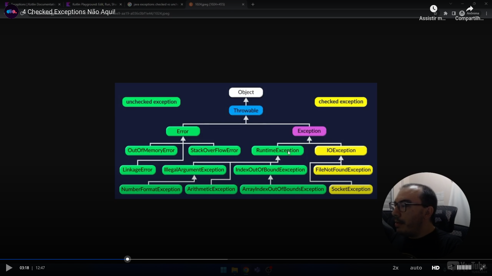

# Introduction

This way you can throw an exception. **Remember:** you **don't** have to use the **new** keyword:

```kotlin
package tests

fun main() {
    throw Exception("This is an exception")
}
```


# Catching an exception

This is how to catch an exception:

```kotlin
package tests

fun main(){
    try {
        print(10/2)
        print(10/0)        
    } catch(e: ArithmeticException) { // you can comment this and the next line ...
        print(e.message)              // ... to see the exception be caugth by the catch block
    } catch(e: Throwable) {
        e.printStackTrace()
    } finally {
        print(" -- finally executado")
    }
    print(" -- depois do try/catch")
}
```


# Try as an expression

You can return a value from a try/catch block. Details:
- You can't use the **return** keyword. The result of the last line is returned;
- A finnaly block is allowed, but do not return a value,

Example:

```kotlin
package tests

fun main() {
    var ret = try {
        20 / 5
    } catch (e: ArithmeticException) {
        null
    }
    print(ret)

    print(" -- ")

    ret = try {
        20 / 0
    } catch (e: ArithmeticException) {
        null
    }
    print(ret)
}
```

An observation: you can have more than one catch block. The first one that matches the exception is executed and if the try/catch block is used as an expression, only the first match is returned.


# Checked exceptions

Teacher showed us this three of Java exceptions. He explained to us that he can do it because Kotlin is based on Java:

