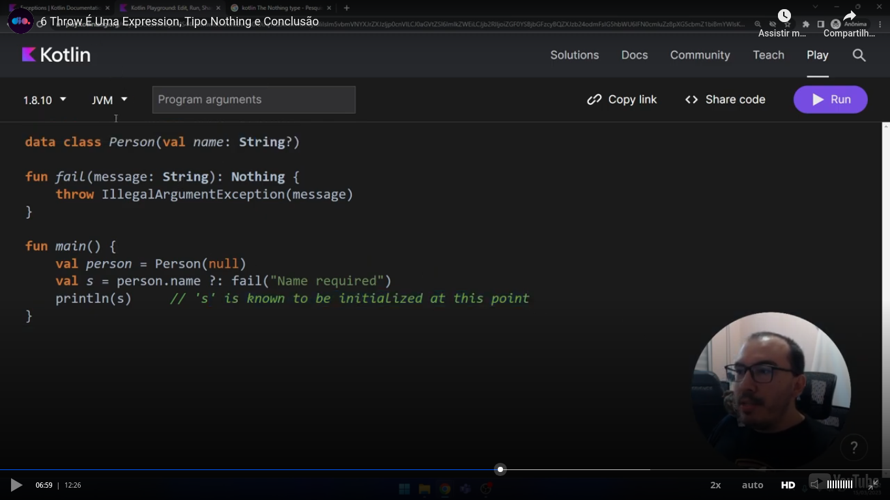

# Introduction

This way you can throw an exception. **Remember:** you **don't** have to use the **new** keyword:

```kotlin
package tests

fun main() {
    throw Exception("This is an exception")
}
```


# Catching an exception

This is how to catch an exception:

```kotlin
package tests

fun main(){
    try {
        print(10/2)
        print(10/0)        
    } catch(e: ArithmeticException) { // you can comment this and the next line ...
        print(e.message)              // ... to see the exception be caugth by the catch block
    } catch(e: Throwable) {
        e.printStackTrace()
    } finally {
        print(" -- finally executado")
    }
    print(" -- depois do try/catch")
}
```


# Try as an expression

You can return a value from a try/catch block. Details:
- You can't use the **return** keyword. The result of the last line is returned;
- A finnaly block is allowed, but do not return a value,

Example:

```kotlin
package tests

fun main() {
    var ret = try {
        20 / 5
    } catch (e: ArithmeticException) {
        null
    }
    print(ret)

    print(" -- ")

    ret = try {
        20 / 0
    } catch (e: ArithmeticException) {
        null
    }
    print(ret)
}
```

An observation: you can have more than one catch block. The first one that matches the exception is executed and if the try/catch block is used as an expression, only the first match is returned.


# Checked exceptions

Teacher showed us this three of Java exceptions. He explained to us that he can do it because Kotlin is based on Java:


Teacher explained us:

- That all exceptions and errors in hierarchy inherits from **Throwable**;
- Kotlin does **not** have the concept of checked exceptions. In Java, blocks that maybe throws a checked exception must deal with the exception (maybe rethrow the exception);
- You see in hierarchy that we have an exception and an error. Error is a most serious problem.


# @throws and creating your own exception

Please see this next code and its comments. Easy to understand, I will not make more comments:

```kotlin
package tests

// Pay attention! You must not specify the type of the second (related to Throwable) message
class MyException(message: String): Throwable(message)

// Pay attention to deails like:
//  - Uppercase 'T'
//  - The use of parentesis
//  - You do not need to open a comment block with "/**" and end with "*/"
@Throws(MyException::class)
fun vote(name: String, age: Int) {
    if (age < 16) {
        throw MyException("Vote is only allowed to a person who have 16 years or more")
    }
    print("Registering a vote to $name -- ")
}

fun main() {
    var total_votes = 0

    total_votes += try {
        vote("André", 42)
        1
    } catch (e: MyException) {
        0
    }

    total_votes += try {
        vote("Enzo", 12)       
        1
    } catch (e: MyException) {
        0
    }

    total_votes += try {
        vote("Julio", 73)
        1
    } catch (e: MyException) {
        0
    }

    print("Total votes: $total_votes")
}
```


# Void and Nothing in Kotlin

You can search in the web, using words parameters of search [like this](https://www.google.com/search?q=kotlin+nothing+type&sca_esv=6031b854f1326109&sxsrf=ADLYWIJPypuVeJRxRwQjaj03W7kW9IdWnA%3A1733925003685&ei=i5hZZ_e_Kb295OUP2-H20Q8&ved=0ahUKEwi3saX_7Z-KAxW9HrkGHduwPfoQ4dUDCBA&uact=5&oq=kotlin+nothing+type&gs_lp=Egxnd3Mtd2l6LXNlcnAiE2tvdGxpbiBub3RoaW5nIHR5cGUyCBAAGIAEGMsBMgYQABgWGB5IvlFQwBFY9k1wAngBkAEBmAGXAqAB2h2qAQYwLjE0Lje4AQPIAQD4AQGYAhagAooeqAITwgIKEAAYsAMY1gQYR8ICBBAjGCfCAggQABgWGAoYHsICBxAjGCcY6gLCAgcQLhgnGOoCwgIUEAAYgAQY4wQYtAIY6QQY6gLYAQHCAhAQABgDGLQCGOoCGI8B2AEBwgIKECMYgAQYJxiKBcICDBAjGIAEGBMYJxiKBcICChAAGIAEGEMYigXCAggQLhiABBixA8ICERAuGIAEGLEDGNEDGIMBGMcBwgILEAAYgAQYsQMYgwHCAg4QLhiABBixAxjRAxjHAcICCBAAGIAEGLEDwgINEAAYgAQYsQMYFBiHAsICBRAAGIAEwgILEC4YgAQYsQMY1ALCAgUQLhiABJgDE_EFyq8SsfQ1XLuIBgGQBgi6BgYIARABGAGSBwYyLjExLjmgB9KUAQ&sclient=gws-wiz-serp).

Talking about nothing, teacher showed us this code:


And talked us that the null have the type "Nothing":
